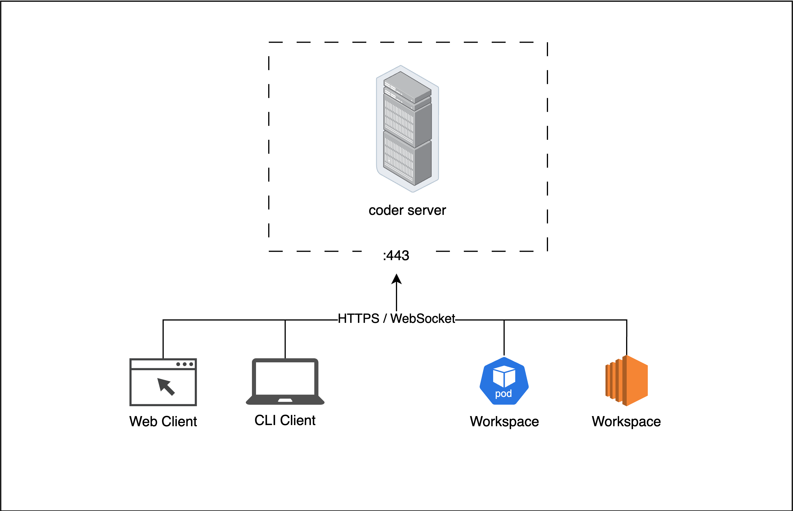

# Networking

Learn about Coder's networking stack.

## The basics

Coder leverages WireGuard® tunnels to route traffic without requiring any ports open on clients (e.g. a developer's laptop) or workspaces (e.g. a Kubernetes pod). All clients and workspaces must be able to `curl` the Coder server address.

Even when a developer connects to a workspace via [VS Code Remote SSH](https://github.com/coder/vscode-coder), [JetBrains Gateway](https://github.com/coder/jetbrains-coder), or [coder ssh](../cli/ssh.md), port 22 does not have to be open on the workspace or the server. The traffic is routed through the Coder server through port 443.

> You can run the Coder server behind an ingress, reverse proxy, and/or LoadBalancer as long as WebSockets are supported.

## Optimizing latency

There are several ways to optimize latency. How to identify what current latency is:

Understand your network:

- Understand VPNs
- Understand where workspace is
- Understand where clients are
- Understand Coder server is

### Direct connections

What is STUN

In some scenarios, a client can establish a direct "peer-to-peer" connection without traffic being routed through the Coder server. Here are the scenarios

- The client is connecting via SSH, not a web browser
- The client and Coder server has access to a STUN server
- We need to expose a UDP port on cluster's end
- Most clients already have NAT traversal capabilities

### Workspace proxies

This is a way to make connections better for web and non-direct connections

### Upgrade header

- Look in health check if DERP header is blocked
- The `upgrade: DERP` header is ideal
- Ideally: we have performance

## Up next

- Learn about [Port Forwarding](./port-forwarding.md)
